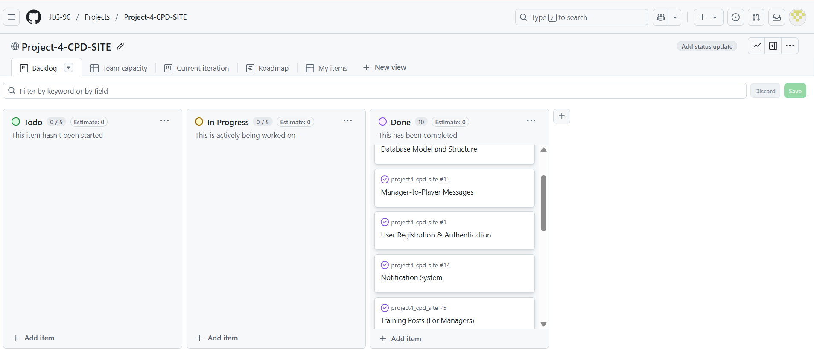
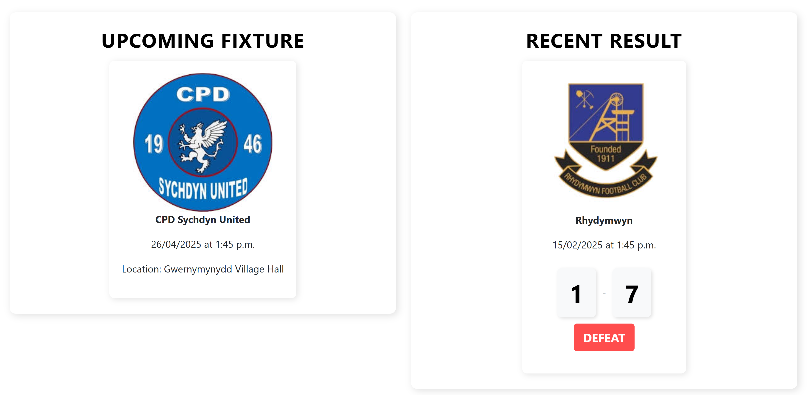
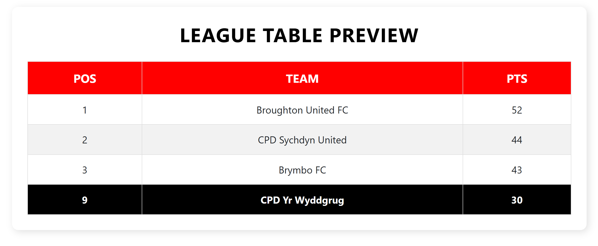
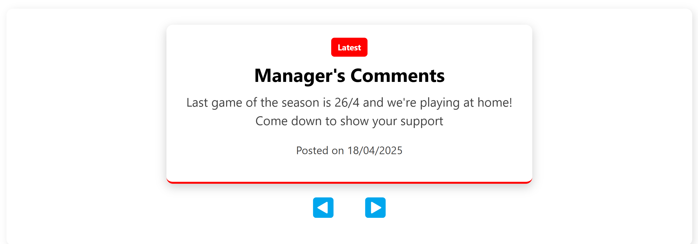
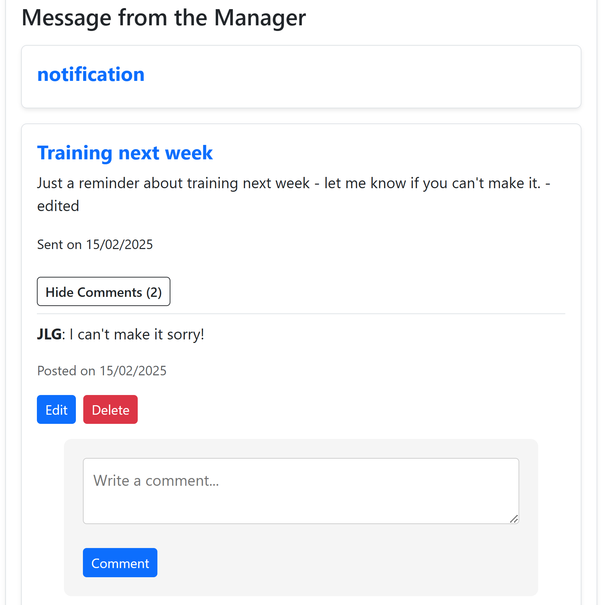
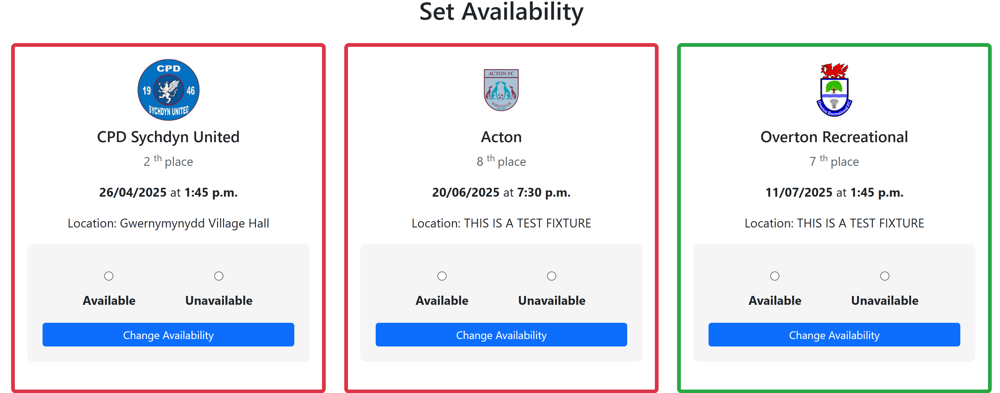
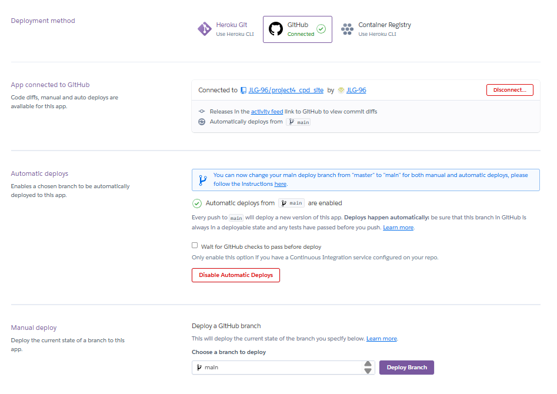
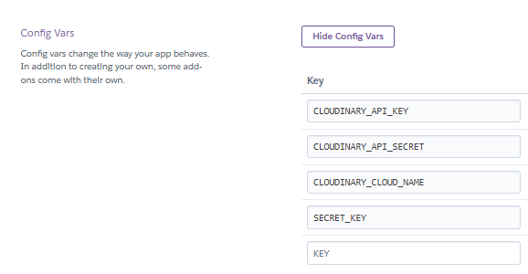

# CPD Yr Wyddgrug Official Website

**CPD Yr Wyddgrug** is a full-stack web application built for a local football club to manage fixtures, results, league standings, and internal team communication.

The site is designed for both **club members** and **public visitors**:
- **Fans** can view recent results, the upcoming fixture, the league table, and the manager’s latest update via the public homepage.
- **Players** can log in to confirm their availability for fixtures and respond to manager posts.
- **Managers** can post team news, track player availability, and receive notifications when players interact.

The application is built using **Django** with a traditional **Model-View-Controller (MVC)** approach and styled using **Bootstrap 5** with custom CSS. The site is mobile responsive and supports dynamic content updates to ensure an accessible and engaging experience for all users.

## Key Features

- ### Role-Based Access Control
  - The platform includes secure login for two types of users — **Managers** and **Players** — each with their own dashboard and permissions. Public users can still access the homepage, fixtures, results, and league table without needing an account.
  - Club members can register using an invite code which would be provided to the club, preventing any user from registering as a player/manager. 

- ### Fixtures & Results Management
  - All upcoming matches and completed results are stored in the system. Fixtures include team logos, match date/time and location. Results display final scores and update the league standings.

- ### Manager Announcements & Posts
  - Managers can post updates to players directly through the system, such as match details, training reminders or tactical updates. Players can read and respond via comments.

- ### Player Availability System
  - Players can mark themselves as **available** or **unavailable** for upcoming fixtures. Fixture cards update dynamically with a coloured border to reflect their selection for easy readability.

- ### League Table Preview
  - A custom-built league table automatically ranks teams based on points and goal difference. CPD Yr Wyddgrug is highlighted for visibility. The table is also responsive for mobile users.

- ### Real-Time Style Notifications
  - Players and managers receive in-dashboard notifications when relevant actions are taken (e.g., availability changed or new message posted). A **red dot** appears in the navbar if new notifications are unread.

- ### Responsive Design with Bootstrap
  - The site uses a mobile-first layout via Bootstrap 5. Key features like the navigation bar, homepage layout and fixture cards adapt fluidly across screen sizes.

## Table of Contents

- [User Stories](#user-stories)
- [User Experience](#user-experience)
- [Wireframe](#wireframe)
- [Database Design](#database-design)
- [Technology Stack](#technology-stack)
- [Testing & Validation](#testing--validation)
- [Deployment](#deployment)
- [Known Issues](#known-issues)
- [Future Features](#future-features)
- [Credits](#credits)


## User Stories

The development of this application was guided by a set of user stories defined in [this GitHub project board](https://github.com/users/JLG-96/projects/5).

User stories were written from the perspectives of the three types of users interacting with the site:

### As a Public User:
- I want to view the upcoming fixtures, recent results, and league standings.
- I want to see updates from the manager so I can stay informed about the team’s progress.

### As a Player:
- I want to log in and see my own dashboard with a list of upcoming fixtures.
- I want to mark my availability for each fixture and see what I’ve previously selected.
- I want to read and comment on posts from the manager to stay informed and respond.
- I want to be notified when a new message has been posted by the manager.

### As a Manager:
- I want to post updates to players, including match details and training notices.
- I want to view which players are available or unavailable for each upcoming fixture.
- I want to receive notifications when players comment on my posts or update their availability.

## User Experience
### Typography & Colour Scheme

The project uses the **Arial** and **sans-serif** system fonts to ensure clean readability and compatibility across all modern browsers and devices.

The colour palette is directly inspired by **CPD Yr Wyddgrug’s official club colours**, reinforcing brand identity across the interface:

- <span style="display:inline-block;width:16px;height:16px;background:#dc3545;border:1px solid #ccc;border-radius:3px;margin-right:6px;"></span> **Primary Colour (Club Red):** `#dc3545`
- <span style="display:inline-block;width:16px;height:16px;background:#000000;border:1px solid #ccc;border-radius:3px;margin-right:6px;"></span> **Secondary Colour (Club Black):** `#000000`
- <span style="display:inline-block;width:16px;height:16px;background:#ffffff;border:1px solid #ccc;border-radius:3px;margin-right:6px;"></span> **Accent Colour (White):** `#ffffff`
- <span style="display:inline-block;width:16px;height:16px;background:#f4f4f4;border:1px solid #ccc;border-radius:3px;margin-right:6px;"></span> **Background Colour (Neutral Grey):** `#f4f4f4`

These colours are consistently applied to headers, banners, buttons, and alert elements to create a cohesive visual experience that aligns with the club’s bold and energetic image.

### Agile Planning

This project was developed using agile methodologies over a span of several weeks. A Kanban-style board was used to track development progress, with columns for each stage including **To Do**, **In Progress**, and **Done**.

Development was guided by:

- **MVP Milestones** — the focus was placed on completing core user-facing features before adding enhancements.
- **User Stories** — each card was written with a specific goal in mind, often based on feedback or required functionality.
- **Manual Testing & Iteration** — features were tested in-browser and refined based on real-world behaviour and layout issues.

All user stories were documented and tracked in the GitHub Project board.
**View the full board here:** [CPD Yr Wyddgrug Project Board](https://github.com/users/JLG-96/projects/5)

#### Kanban Board Screenshot


### Features

<details>
<summary><strong>Navigation Bar</strong></summary>

- The site features a responsive navigation bar that appears across all pages via the shared `base.html` template.
- It adapts to screen sizes using Bootstrap — collapsing into a hamburger menu on smaller devices for improved mobile usability.
- The navbar dynamically updates based on the user's authentication status:
  - **Public users** see links to: Home, Fixtures, Results, and Login.
  - **Players** see: Home, Fixtures, Results, Player Dashboard, and Logout.
  - **Managers** see: Home, Fixtures, Results, Manager Dashboard, and Logout.
- Logged-in users also see a small text tag showing: `Logged in as: <username>` for clarity.
- A red **notification dot** appears next to the Dashboard link if a new notification is present:
  - This red dot serves as a visual cue to prompt users to check their dashboard.
  - The dot disappears only when all notifications have been removed. Otherwise, it moves to the next unread notification.


</details>

<details>
<summary><strong>Team Banner</strong></summary>

- A custom banner is displayed at the top of the homepage, featuring:
  - The CPD Yr Wyddgrug club logo (circular image).
  - Club name in bold, large font.
  - Subheadings for Manager name, Home Ground, and Year Founded.
- Designed using custom CSS for a strong visual identity and club branding.
- The banner is hidden on small screens to preserve space and improve readability on mobile.


</details>

<details>
<summary><strong>Role-Based Dashboards</strong></summary>

- Users log in securely and are directed to different dashboards based on their role:
  - **Players** can view fixtures and confirm availability.
  - **Managers** can post announcements to the player dashboard directly and to the homepage for fans. Can also view player availability.
- Public users (fans) can browse the homepage, fixtures, results, and league standings without any need for logging in.
- Registration is restricted using an **invite-only system**, ensuring only club members can access protected features.

</details>

<details>
<summary><strong>Fixtures & Results on Homepage</strong></summary>

- Fixtures display opponent name, club logo, date, time, and location.
- Results include final scores and a match outcome tag (WIN / DRAW / DEFEAT).
- The homepage highlights the most recent result and upcoming fixture only/.
- The full list of upcoming and completed matches can be found on the Fixtures and Results pages.



</details>

<details>
<summary><strong>League Table Preview</strong></summary>

- Dynamically generated league table preview sorted by:
  - Total points.
  - Goal difference.
- The table is to emphasise the position of CPD Yr Wyddgrug in relation to the top 3.
- CPD Yr Wyddgrug is automatically highlighted in the table.
- The preview is horizontally scrollable on smaller screens for better mobile usability.



</details>

<details>
<summary><strong>Manager's comments</strong></summary>

- The **Manager Comments** section allows the club to share public updates with fans via the homepage.
  - Posts can include match previews, team news, transfer updates, or post-game reflections.
- These updates are submitted from the manager dashboard using a simple form interface.
- Fans (public users) can read the 5 most recent comments.
  - The most recent post is shown first and tagged with **"Latest"** for visibility.
  - Users can cycle through recent posts using left/right arrow buttons.
  - Older posts (beyond the 5 most recent) are removed from the homepage view but remain stored in the database.
- If the latest post is deleted, the **"Latest"** tag is reassigned to the next most recent comment.
- Managers can edit or remove their own posts at any time.



</details>

<details>
<summary><strong>Manager Posts to Player Dashboard</strong></summary>

- Managers can post announcements to all players, including match details, training reminders, and general updates.
- Each post includes a title, content, and timestamp.
- Players can comment on messages, and managers receive notifications when comments are made.
- Managers can edit or delete their posts.



</details>

<details>
<summary><strong>Player Availability System</strong></summary>

- Players can select whether they are **available** or **unavailable** for each upcoming fixture.
- Fixture cards dynamically update with:
  - A **green border** for availability.
  - A **red border** for unavailability.
- Submitting availability is quick and clearly reflected on the dashboard.
- Availability can also be easily changed by the player - a notification is sent to the manager when availability has been set (including changed).



</details>

<details>
<summary><strong>Notification System</strong></summary>

- In-dashboard notifications appear when:
  - A manager posts a new message or edits one.
  - A player changes their fixture availability, comments on a message or edits it.
- The most recent notifications include a **"NEW"** tag and are visually highlighted. Notifications are green to help express which is the most recent and go red if they are old.
- A **red dot** appears in the navbar if there are notifications.
- Each notification can be dismissed individually - removal of all notifications removes the red dot.


</details>

<details>
<summary><strong>Login and Registration</strong></summary>

  - Accessible from the navbar.
  - Requires a valid **username** and **password**.
  - Authenticated users are redirected to their assigned dashboard (Manager or Player).
  - Invalid credentials return an error message.

- **Registration:**
  - Registration is not publicly available.
   - A one-time **invite code** is required upon first login to complete registration.
  - Members of the club will asign themselves a player / manager upon registration.

</details>

## Wireframe
 A clean layout with structured sections helps fans and club members find key information quickly—whether on desktop or mobile devices.

The wireframe was created to plan the homepage layout and the dynamic content areas.

| Wireframe Screenshot |
|----------------------|
|  |

From this base wireframe, the **Manager Dashboard** and **Player Dashboard** were developed.

The wireframe was used as a guide, rather than a strict template - allowing room for agile evolution based on feedback and functionality needs.

## Database Design

The database was designed using Django’s ORM (Object-Relational Mapping) to support all key club functionalities, ensuring each user interaction is stored and processed effectively.

- **Users** are authenticated through Django’s built-in `User` model. Each user is extended with a `Profile`, defining them as a **Player** or **Manager**.
- **Fixtures** store upcoming and completed match details including opponent, time, location, and score.
- **Results** are derived from completed fixtures and feed into the team’s statistics and league table.
- **Teams** store persistent information about clubs in the league, including their manager, logo, stats, and standings.
- **PlayerAvailability** records a player’s availability status for upcoming matches.
- **ManagerPosts** are public-facing updates from the manager shown on the homepage.
- **ManagerMessages** are private updates sent directly to players.
- **Comments** allow players to reply to internal manager messages.
- **Notifications** track availability updates, new messages, and new comments to keep users informed.

This structure allows full CRUD (Create, Read, Update, Delete) functionality across all relevant areas for both Managers and Players.

## Technology Stack

### Technology Used

| Category           | Tool/Library                   | Version        |
|--------------------|--------------------------------|----------------|
| **Backend**        | Django                         | 5.1.6          |
| **Database**       | PostgreSQL (via Heroku)        | -              |
| **Frontend**       | HTML5, CSS3, JavaScript        | -              |
| **Styling**        | Bootstrap 5, Custom CSS        | -              |
| **Media Storage**  | Cloudinary                     | 1.42.2         |
| **Static Files**   | Whitenoise                     | 6.9.0          |
| **Image Handling** | Pillow                         | 11.1.0         |
| **Server**         | Gunicorn                       | 23.0.0         |
| **Environment**    | Python Decouple                | 3.8            |

### Other Dependencies

- `asgiref==3.8.1`  
- `certifi==2025.1.31`  
- `charset-normalizer==3.4.1`  
- `django-cloudinary-storage==0.3.0`  
- `idna==3.10`  
- `requests==2.32.3`  
- `six==1.17.0`  
- `sqlparse==0.5.3`  
- `tzdata==2025.1`  
- `urllib3==2.3.0`

### Tools Used

- **Git & GitHub** – For version control and code hosting.  
- **Gitpod** – Cloud-based IDE used during development.  
- **Heroku** – Deployment platform for hosting the live site.  
- **Cloudinary** – Image hosting and delivery service for team logos.


## Design
- Initial plan, wireframe: 
This is the initial design. Showing the homepage with the various sections implemented into it. Throughout building of the homepage did the ideas for the separate player / manager dashboards develop.

## Current Features
- **Robust Django Project Setup & Team App Creation**
  - Organized project structure following the MVC pattern.
  
- **Comprehensive Team Model**
  - Captures essential team details: manager, home ground, founded year, and team logo.
  - Tracks league statistics including matches played, wins, draws, losses, goals for/against, and points.
  
- **Media & Static File Handling**
  - Integrated Cloudinary for dynamic media storage of team logos and other uploaded images.
  - Configured Whitenoise for efficient serving of static files.
  
- **Responsive Homepage**
  - Features a team banner displaying club logo, team name, manager details, home ground, and founding year.
  - Shows an upcoming fixture section with relevant opponent logos and match details.
  - Includes a league table preview with CPD Yr Wyddgrug highlighted.
  - Displays the manager's latest comment/news section.
  
- **Dedicated Fixtures & Results Pages**
  - Fixtures Page: Lists only upcoming matches.
  - Results Page: Displays only completed matches.
  
- **Dynamic League Table**
  - Automatically updates team standings based on match results.
  - Sorted primarily by points and secondarily by goal difference.
  
- **User Authentication & Role-Based Access**
  - Secure login/logout system integrated into the navbar.
  - Role differentiation ensuring managers access a Manager Dashboard while players have a Player Dashboard.
  - Enforced profile creation for all users prior to accessing dashboards.


### User Authentication & Profiles
- **Secure Login/Logout System**
  - Integrated into the navbar for easy access.
  - User accounts (both Players and Managers) are created and managed by an admin (public registration is disabled).

- **Role-Based Access Control**
  - Managers are granted exclusive access to a dedicated Manager Dashboard.
  - Players have their own Player Dashboard tailored to their needs.


### Manager & Player Dashboards
- Both dashboards recieve notifications with the newest one being tagged as "NEW".

- **Manager Dashboard**
  - Allows managers to post updates, match information, and team news straight to the players.
  - Provides tools to manage fixtures based on player availability and can communicate club announcements with any user.
  - Gets notified when a player has changed their availability or commented on a message.
  
- **Player Dashboard**
  - Enables players to view upcoming fixtures and confirm their availability.
    - Colour of fixture cards reflects players avaialability for easier viewing.
  - Can write comments back to the manager. 
  - Gets notified when the manager has sent a message.
  
- **Access Restrictions & Profile Enforcement**
  - User accounts (both players and managers) are created and managed exclusively by an administrator (no public registration).

### Fixtures & Results System
- **Dynamic Match Result Recording**
  - Match outcomes (wins, draws, and losses) are automatically calculated based on inputted game data and recorded on the homepage to reflect the most recent result. All results are stored in the results page.
- **Fixture Model Enhancements:**
  - Replaced the `is_played` field with a more descriptive `match_completed` field.
  - Corrected opponent assignment to ensure fixtures accurately reflect the competing teams.
  - Improved goal tracking to reliably record and update scores for both teams.

## Deployment

This project was deployed to [Heroku](https://www.heroku.com/) using GitHub integration, with environment variables for configuration and security.

---

### Heroku Deployment Steps

1. Log in to [Heroku](https://dashboard.heroku.com/) and create a new app.
2. Provide a unique app name and select your region.
3. Navigate to the **Deploy** tab and choose **GitHub** as the deployment method.
4. Connect your GitHub account and search for your repository by name.
5. Leave the deployment branch set to `main`, and connect the repository.

  

6. Go to the **Settings** tab and click **Reveal Config Vars**.
7. Add the following configuration keys and provide your own values:
   - `DATABASE_URL`
   - `SECRET_KEY`
   - `CLOUDINARY_URL`

  

8. Under **Buildpacks**, click **Add Buildpack** and select **Python**.
9. Return to the **Deploy** tab and click **Deploy Branch** to begin deployment.
10. Wait for the deployment to complete and verify that the site is live.

---

### Security Measures

- `DEBUG = False` has been set to ensure production-level security.
- Sensitive variables like `SECRET_KEY`, `DATABASE_URL`, and `CLOUDINARY_URL` are stored in Heroku Config Vars.
- A local `.env` file is used for development and excluded via `.gitignore`.
- All sensitive values are accessed via `os.environ.get()` in `settings.py`.

---

## Upcoming Features
- **Enhanced User Analytics**
  - Implement detailed reporting and insights on team performance, match statistics, and user engagement.
  - Player pictures could be uploaded and integrated to the homepage. Statistics for each player and the posting of the man of the match that users could vote for.
  - A possible 'Meet the players' page, providing sporting information about the players but also some personal details for the users to enjoy.
- **Advanced Notification System**
  - Build real-time, push notifications for match updates, team news, and player availability alerts.
- **Calender functionality**
  - Potential to integrate a calendar into both dashboards to more clearly show fixtures and to include scheduled training sessions. Players can set their availability direct to the calendar. Can be sent reminders of important upcoming dates.
- **Contact us section**
  - A form page for other teams to fill out to get in contact to schedule friendly games. Other players to get in touch about reequesting to join etc.
- League table to automatically update upon addition of results rather than manually having to do it. 
- Results to show goalscores names and any players that got an assist / yellow / red card.


## Bugs Fixed & Issues Resolved

### League Table Not Updating
**Issue:** Standings were resetting to zero after every update.  
- **Cause:** Incorrect query filtering and a missing opponent-team link in calculations.  
- **Fix:** Refactored `calculate_standings()` to correctly sum matches (both home and away).  
- **Result:** Teams now track points, matches, goals, and rankings accurately.

### Fixtures Not Displaying
**Issue:** Some fixtures were not appearing on the homepage.  
- **Cause:** The query was filtering using only one side of the match (either home or opponent) instead of both.  
- **Fix:** Updated the query to check conditions for both the home team and opponent.  
- **Result:** Upcoming fixtures and recent results now load properly.

### Reverse URL Errors
**Issue:** Navigation links broke due to mismatched URL names (e.g., using "home" instead of "homepage").  
- **Fix:** Revised `urls.py` and updated all template links to reference the correct view names.  
- **Result:** Navigation now functions seamlessly across the site.

### Logout Not Working
**Issue:** The logout link was broken due to an incorrect authentication setup.  
- **Fix:** Connected Django’s built-in `LogoutView` and updated the navbar accordingly.  
- **Result:** Users can now log out and log back in successfully.

### Static Files Not Loading on Deployment
**Issue:** CSS and other static assets were not served on Heroku.  
- **Cause:** The environment variable `DISABLE_COLLECTSTATIC` was set and/or Whitenoise was not properly configured.  
- **Fix:** Removed `DISABLE_COLLECTSTATIC` from Heroku config vars, added `whitenoise.middleware.WhiteNoiseMiddleware` to the MIDDLEWARE list, and ensured correct static file settings (`STATIC_URL`, `STATIC_ROOT`, `STATICFILES_DIRS`).  
- **Result:** Static assets are now correctly collected and served on Heroku.

### Media Files Not Persisting
**Issue:** Uploaded media (e.g., team logos) were not persisting on Heroku due to its ephemeral filesystem.  
- **Cause:** Heroku’s file system is not designed for persistent storage of media uploads.  
- **Fix:** Integrated Cloudinary by setting `DEFAULT_FILE_STORAGE` to `'cloudinary_storage.storage.MediaCloudinaryStorage'` in `settings.py` and configured Cloudinary credentials via environment variables.  
- **Result:** Media files now persist and are reliably served from Cloudinary.

### Virtual Environment & Dependency Issues
**Issue:** Runtime errors due to missing modules (e.g., gunicorn, Pillow, whitenoise).  
- **Cause:** Dependencies were either not installed in the active virtual environment or were missing from `requirements.txt`.  
- **Fix:** Recreated the virtual environment, installed all necessary dependencies using `pip install`, and updated `requirements.txt` with `pip freeze > requirements.txt`.  
- **Result:** All dependencies are now properly installed and recognized in both local and Heroku environments.

### Incorrect Model Field Storage for Team Logos
**Issue:** Team logo fields were automatically storing a `team_logos/` prefix, leading to broken image paths (e.g., `/static/team_logos/team_logos/rhyd_logo.jpg`).  
- **Cause:** Using an `ImageField` with `upload_to='team_logos'` forces Django to prepend that directory to the stored filename.  
- **Fix:** Changed the model field for logos to a `CharField` so that only the filename (e.g., `rhyd_logo.jpg`) is stored, and manually placed the actual images in the `static/team_logos/` folder.  
- **Result:** Team logos now display correctly with the static file references.

### Static Files Not Loading When DEBUG = False
**Issue:** When DEBUG = False, static files (CSS) were not loading, and the browser console showed MIME type errors (text/html instead of text/css).
- **Casue:** This was caused by Django’s default behavior, which does not serve static files in production mode.
- **Fix:** Updated settings.py to differentiate static handling between development and production:
if DEBUG:
    STATICFILES_STORAGE = "django.contrib.staticfiles.storage.StaticFilesStorage"
else:
    STATICFILES_STORAGE = "whitenoise.storage.CompressedManifestStaticFilesStorage"
  - Ran collectstatic to ensure static files were available in production mode:
  python manage.py collectstatic --noinput
  - Used --insecure mode for local testing with DEBUG = False:
  python manage.py runserver --insecure
- **Result:** Static files now load correctly in both development (DEBUG = True) and production (DEBUG = False) environments.
  - The --insecure flag allows static files to be served locally without changing DEBUG back to True.


##  **Setup & Configuration**
### Media & Static Files Configuration
- **Media Files (User Uploads):**  
  In `settings.py`, configure media handling as follows:
  ```python
  MEDIA_URL = '/media/'
  MEDIA_ROOT = BASE_DIR / 'media'
    - Note: With Cloudinary integrated for media storage, uploaded images will be stored remotely. These settings remain useful for local development.

- **Static Files:**
- Configure static files to be served using Whitenoise:
STATIC_URL = '/static/'
STATIC_ROOT = os.path.join(BASE_DIR, 'staticfiles')
STATICFILES_DIRS = [
    os.path.join(BASE_DIR, 'static'),
]

- **URL Configuration for Development**
- Add the following to your main urls.py to serve media files during development:
from django.conf import settings
from django.conf.urls.static import static
from django.urls import path, include
from django.contrib import admin

urlpatterns = [
    path('admin/', admin.site.urls),
    path('', include('team.urls')),  # Main app routes
] + static(settings.MEDIA_URL, document_root=settings.MEDIA_ROOT)

- **Environment Variables (.env)**
- For local development; 
create a .env file in the project root (this file should be added to .gitignore):

  # .env file

  # Django secret key
  SECRET_KEY=your_production_secret_key

  # For local development
  DEBUG=True

  # Cloudinary credentials
  CLOUDINARY_CLOUD_NAME=dmzwtex3f
  CLOUDINARY_API_KEY=213153381958977
  CLOUDINARY_API_SECRET=18_8hXbd-w0wk64V9T3pmJGqeP4


##  **Testing Summary**
### **Manual Testing Performed**
-  **Homepage displays correctly**:
  - Upcoming fixture 
  - Latest result 
  - League table preview 
  - Manager’s comment 
-  **Navigation Works**
  - Fixtures link  (only upcoming matches)
  - Results link  (only completed matches)
- **Base template applied consistently** across all pages
- **User Authentication & Profiles Working**
  - Login/logout functions correctly
-  **Dynamic Standings Confirmed**
  - Points update correctly 
  - Goal difference is calculated 
  - Teams are ordered properly
- **Automated Testing**
- The project includes a suite of automated tests to verify core functionality of the application. These tests cover aspects such as model behavior and view responses.

To run all tests, execute the following command from your project root: (python manage.py test).

- For example, a recent test run produced the following output:
Found 3 test(s).
Creating test database for alias 'default'...
System check identified no issues (0 silenced).
Manager Posts Retrieved: 0
Latest Result: None
.Manager Posts Retrieved: 0
Latest Result: None
..
----------------------------------------------------------------------
Ran 3 tests in 0.103s

OK
Destroying test database for alias 'default'...

***This output confirms that all tests passed successfully, ensuring that the core application logic (such as displaying fixtures and results, and handling manager posts) is functioning as expected.***

- **Code Style & Coneventions**
  - The project follows PEP8 guidelines.
  - Code is well-documented and uses consistent naming conventions.
  - Files are named consistently for cross-platform compatibility.


- **Validators** 

- Using https://validator.w3.org/nu/#textarea; 
  - ***Home page:*** 
  - ***Fixtures page:*** 
  - ***Results page:*** 
  - ***League Table page:*** 
  - ***Login page:*** 
  - ***Manager Dashboard:*** 
  - ***Player Dashboard:*** 
    - In the current version of the Player Dashboard, the rendered HTML shows two main validation errors when checked against W3C standards:
      - ***1. Duplicate ID "id_content"***
        - The “View Source” reveals multiple <textarea> elements on the page, each with id="id_content".
        - Despite searching the codebase and templates, the source of these duplicate IDs could not be definitively located or overridden.
        - This may be due to auto-generated IDs from form libraries or partials.
      - ***2. Inline <style> Tags in the <body>***
        - Two <style> blocks appear near the end of the <body> section.
        - HTML5 expects all <style> elements inside <head>, resulting in a validation error.
      **Impact**
      - These issues do not appear to break functionality in browsers.
      - However, they cause warnings or errors in standard validation tools and could potentially cause edge-case rendering issues or conflicts with accessibility tools.

      **Status**
      - We have attempted to trace the source of these issues (via project-wide searches, partial templates, and framework configurations) but have not been able to successfully locate or fix them.
      - Future development will aim to refactor or remove these duplicate IDs and relocate any inlined <style> tags.

      **Attempts to Fix**
      1. Duplicate ID:
        - Code Searches: Searched the entire codebase (templates, partials, forms, models, etc.) for id="id_content". Could not locate any literal use of that string.
        - Override or Rename Field: Investigated whether Django’s (or another framework’s) form system auto-generates this ID. Tried manually overriding or renaming the form field.
        - Removed/Commented Out Code: Temporarily removed/commented out certain form blocks and partials to see if the duplicate id_content disappeared.
        - Result: The duplicate IDs still appear in the final rendered HTML, despite multiple troubleshooting attempts.

      2. Inline <style>:
        - Moving CSS: Attempted to relocate inline <style> blocks to the <head> section or into a standalone stylesheet.
        - Template Inheritance: Checked base templates and partials to ensure no <style> tags were defined at the bottom of <body>.
        - Search for Plugin Injections: Investigated whether a plugin or external script automatically injects CSS.
        - Result: The <style> tags remain in the final HTML output; their exact origin could not be pinpointed.

- Using CSS-Validator: https://jigsaw.w3.org/css-validator/
  - ***CCS Validation*** 

---

## Styling & Responsiveness

To enhance the site's adaptability across devices, Bootstrap 5 was integrated. Care was taken to preserve all original custom CSS while incrementally wrapping elements in Bootstrap’s responsive grid classes (e.g., `.row`, `.col-lg-*`, `.container`). 

Key improvements:
- Navigation bar now uses Bootstrap classes for consistent styling and collapse behavior.
- Homepage layout is structured using Bootstrap rows and columns, ensuring elements stack cleanly on smaller screens.
- League table preview is scrollable horizontally on small screens for usability without sacrificing styling on desktop.
- The “Manager’s Comments” heading is automatically hidden on screens below 455px to prevent text overflow.
- Media queries were retained during migration to Bootstrap to allow phased cleanup.

This hybrid approach ensures the site remains visually consistent while gaining the benefits of Bootstrap’s mobile-first responsiveness.
